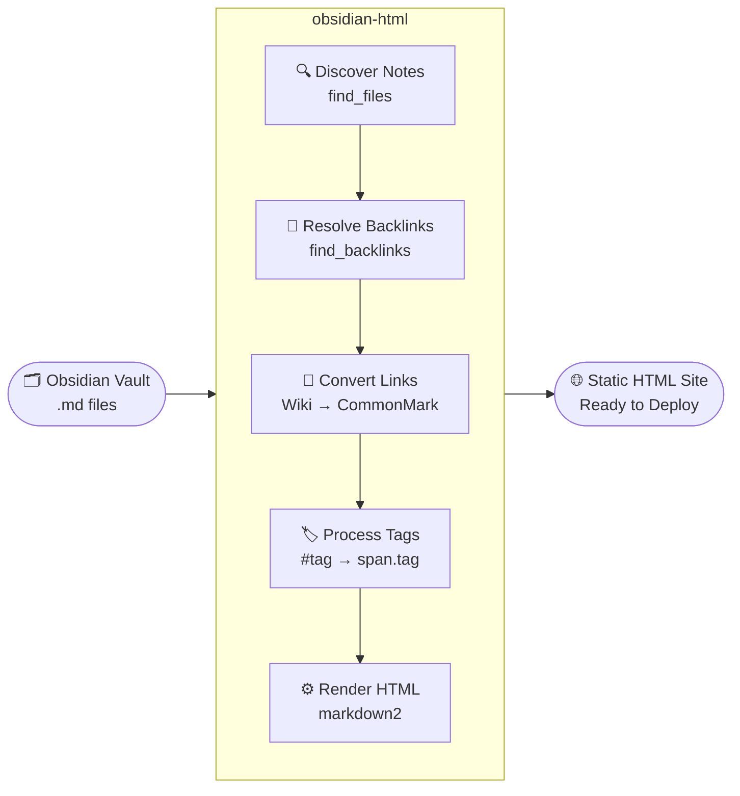

# 🗂️ obsidian-html

> **Turn your Obsidian vault into a blazing-fast static website — in one command.**

No server required. No build pipeline. Just clean, portable HTML from your Markdown notes.

---

## ✨ Features

- **📄 Pure Static Output** — generates standalone `.html` files you can host anywhere: GitHub Pages, Netlify, S3, or a plain USB drive.
- **🔗 Wiki-link Support** — `[[note]]`, `[[note|alias]]`, and `[[note#header]]` links are all automatically resolved and converted to proper HTML anchors.
- **🏷️ Obsidian Tag Rendering** — `#tags` are converted to styled `<span class="tag">` elements, ready for your CSS.
- **⬅️ Automatic Backlinks** — every note gets a **Backlinks** section generated automatically, so your knowledge graph is preserved in HTML.
- **📝 Powered by Markdown2** — full support for fenced code blocks, tables, strikethrough, footnotes, header IDs, and more — out of the box.
- **📁 Subdirectory Support** — include extra vault sub-folders with a single flag.
- **🎨 Custom Templates** — bring your own HTML template and inject note content wherever you want.

---

## 🚀 Installation

**Requirements:** Python 3.7+

```bash
# Clone the repository
git clone https://github.com/kmaasrud/obsidian-html
cd obsidian-hugo

# Install the package
pip install .
```

Or install directly from the source in one step:

```bash
pip install git+https://github.com/kmaasrud/obsidian-hugo.git
```

Dependencies (`markdown2`, `regex`) are installed automatically.

---

## ⚡ Quick Start

```bash
# Basic usage — outputs HTML to <vault>/html/
obsidian-html /path/to/your/vault

# Specify a custom output directory
obsidian-html /path/to/your/vault -o /path/to/output

# Include extra subdirectories from your vault
obsidian-html /path/to/your/vault -d daily-notes projects

# Use a custom HTML template
obsidian-html /path/to/your/vault -t /path/to/template.html
```

### Template Format

Your HTML template can use the following placeholders:

```html
<!DOCTYPE html>
<html>
  <head><title>{title}</title></head>
  <body>
    {content}
  </body>
</html>
```

---

## 🔄 How It Works



---

## 📁 Project Structure

```
obsidian_html/
├── __init__.py      # CLI entry point
├── __main__.py      # Module runner
├── Vault.py         # Core vault class — discovery, backlinks, export
├── format.py        # Markdown → HTML conversion & link formatting
└── utils.py         # Helpers: slug generation, file discovery, backlink search
```

---

## 🤝 Contributing

Contributions are very welcome! Here's how to get started:

1. **Fork** the repository on GitHub.
2. **Create** a feature branch: `git checkout -b feature/my-improvement`
3. **Commit** your changes with a clear message: `git commit -m "feat: add XYZ support"`
4. **Push** to your fork: `git push origin feature/my-improvement`
5. **Open a Pull Request** — describe what you changed and why.

Please open an issue first for large changes so we can discuss the approach before you invest time building it.

---

## 📄 License

This project is licensed under the **MIT License** — you're free to use, modify, and distribute it. See [LICENSE](LICENSE) for the full text.

---

<p align="center">
  Made with ❤️ by <a href="https://github.com/kmaasrud">kmaasrud</a>
</p>
